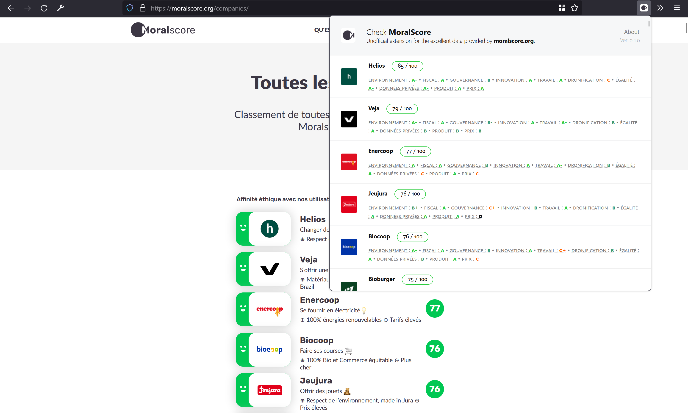

# Moralscore Checker (unofficial)
Web Extension: Easily check the moralscores of the companies presented on the webpage. 
## About
Very simple extension that looks for the different Brands named on your current webpage, and checks [moralscore](https://moralscore.org) for their data. It also gives you better alternatives to make better decisions.

## Warning

It is mostly a proof of concept to test for the usefulness of this extension. You cannot run this extension for now as I do not have formal access to the data, and the data used as been scraped.

## Credit
- [Moralscore](https://moralscore.org) for all the data. 
- Pino Ceniccola, for all the boilerplate code from [What Hacker News Says](https://github.com/pinoceniccola/what-hn-says-webext) I had the pleasure to discover his estension after I built the same one, but way uglier. Good lesson. 